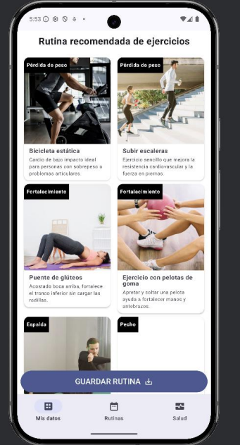

# 🏋️ Senior Fitness - Android App 
**Senior Fitness** es una aplicación Android diseñada para recomendar ejercicios personalizados a personas mayores, utilizando datos de salud recogidos desde **Health Connect** y una inteligencia artificial que adapta las rutinas según las necesidades de cada usuario.  

---

## 🚀 Features

- **Recomendaciones Personalizadas:** La app analiza datos de salud y preferencias para sugerir ejercicios seguros y adaptados.  
- **Integración con Health Connect:** Recupera información de pasos, frecuencia cardíaca, actividad diaria y más.  
- **IA para Rutinas Inteligentes:** Utiliza la API de **ChatGPT/OpenAI** para generar planes de ejercicio personalizados.  
- **UI Moderna con Jetpack Compose:** Interfaz intuitiva, clara y accesible para personas mayores.  
---

## 🛠 Tech Stack

- **Lenguajes:** Kotlin, Java  
- **UI:** Jetpack Compose  
- **Backend:** Firebase Firestore  
- **APIs:** Health Connect, OpenAI / ChatGPT API  
- **Arquitectura:** MVVM, StateFlow  
- **Control de versiones:** Git / GitHub  

  
